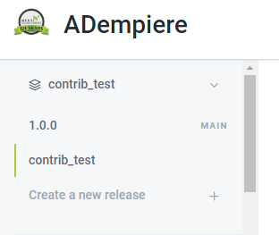

# Version Control

The documentation collection is maintained in GitHub at [https://github.com/adempiere/adempiere-documentation](https://github.com/adempiere/admpiere-documentation). Corrections and updates can be made through pull-requests to that repository.

The goal is to maintain the set of documentation in parallel with the software so individual software releases will have corresponding documentation releases. Branches in the documentation repository will mirror the main branches in the software repository with the "master" branch being the most current release. Editing work should be done in the "develop" branch. Branches with names like "v3.9.1" will identify version releases.

To contribute, you will need an account on [GitHub](http://github.com). Fork the [ADempiere-Documentation](https://github.com/adempiere/adempiere-documentation) repository to your GitHub account.

Create or login to your account on [GitBook](https://www.gitbook.com/) and create a space linked to your GitHub fork of the ADempiere documentation. When you specify the branches to sync with your GitHub account, use the following branch names:

`master develop v* contrib*`

After GitBook has synced content with your GitHub fork, you can use GitBook to make edits in your fork. At the top left of the GitBook window, you will see the name of the branch/version you are currently reading. Expand that list and there will appear a link with the name "Create a new release +".

Select "Create a new release" and give it a name that follows the wildcard patterns, for example "contrib\_grammar". A copy of the master version will be created. Make your edits and save them. Add a comment to describe the draft's changes in the space above the "draft" icon and then publish them. GitBook will sync with your GitHub repository automatically.

When you have completed all the edits and want to submit them to the main adempiere-documentation repository, go to your account on GitHub and submit a pull request from your edited version to the target version/branch in the ADempiere repository - typically "develop".  When a set of edits is complete, the develop branch will be merged into the master branch and the edits will be available in the official documentation.

GitHub provides excellent documentation on making pull requests. Be sure to target the correct branch in the main repository when making the pull request.

